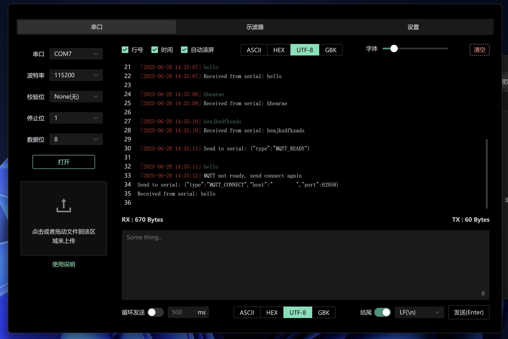
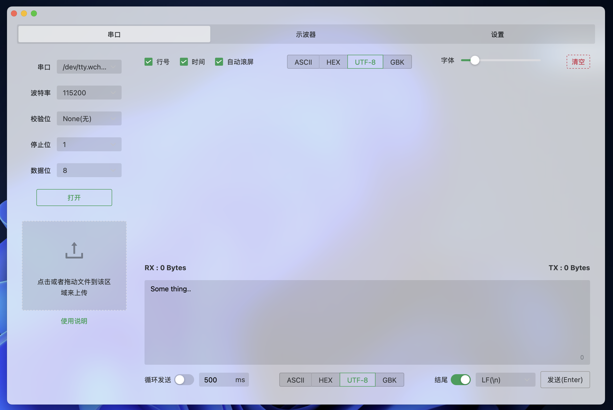
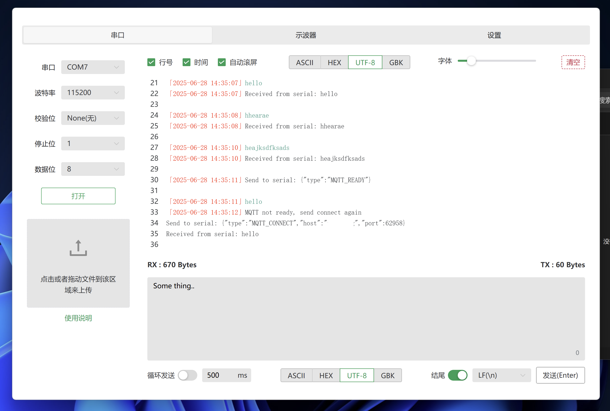

# 🌐 SerialInsight

一个优雅、轻量、跨平台的串口调试工具，支持暗色/亮色模式切换，基于 **Tauri + Vue 3 + Naive UI** 构建。

---

## ✨ 功能特色
- ✅ Mac 安装后仅16MB(安装包6MB)，Windows安装后仅30 MB（安装包7MB）
- ✅ 串口参数配置：波特率、校验位、停止位、数据位
- ✅ 支持 ASCII / HEX / UTF-8 / GBK 编码切换
- ✅ 实时显示接收内容，支持换行、时间戳、自动滚动
- ✅ 发送框支持手动或循环发送，自动追加换行符
- ⛔️ 串口文件传输（XModem协议，未实现）
- ✅ TX / RX 字节计数统计
- ✅ 完美支持深色 / 亮色模式
- ✅ 快速响应，原生性能，打包体积极小

---

## 📷 预览截图






---

## 🖥 技术栈

- ⚙️ 桌面端框架：[Tauri](https://tauri.app/)
- 🌱 前端框架：[Vue 3](https://vuejs.org/)
- 💎 UI 库：[Naive UI](https://www.naiveui.com/)
- 🎨 主题管理：系统主题感知 + 自定义切换
- 📦 打包发布：支持 macOS / Windows / Linux 构建

---

## 🚀 开发 & 运行

确保你已安装：

- Node.js ≥ 16
- Rust（用于 Tauri）
- pnpm / yarn / npm

```bash
# 克隆项目
git clone https://github.com/yourname/serial-insight.git
cd serial-insight

# 安装依赖
pnpm install

# 启动开发环境
pnpm tauri dev